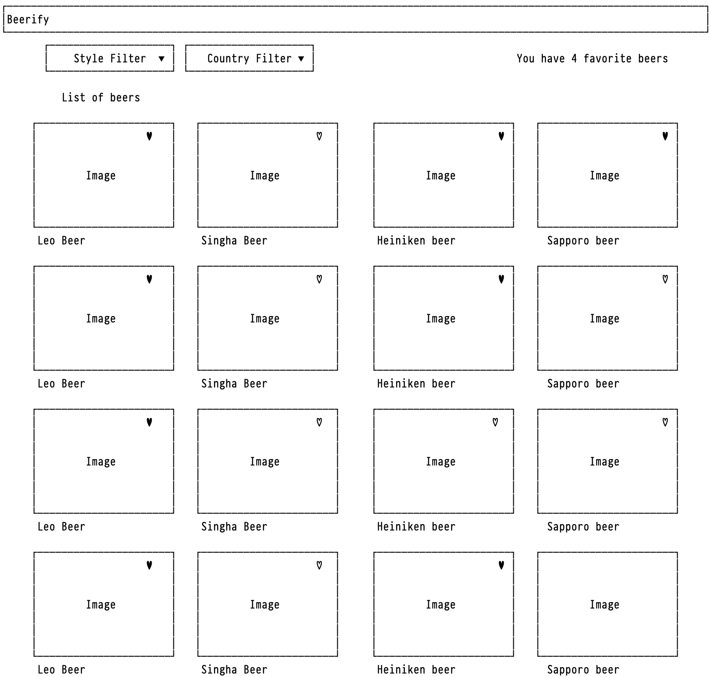
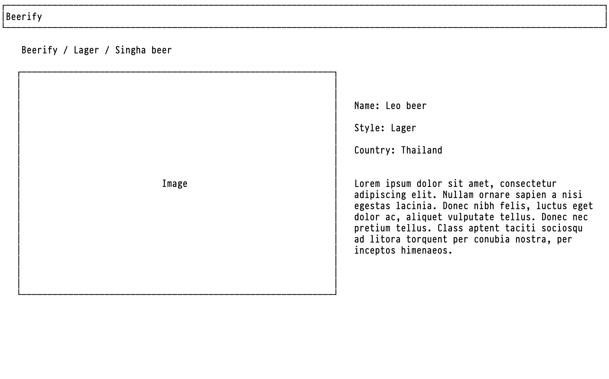

## SNEAK Front-End coding challenge

### Overview

In this challenge, you will need to write a simple React based web application. The challenge would help us understand your experiences and skills

We have initialed react project for you which:

1. You could start graphql api server with `npm run gql`, and browse gql playground at http://localhost:3001
2. You could start development with `npm run start`
3. Wireframe for home and detail page

There are 2 main pages that you need to implements

- Home page
- Detail Page

#### Home page

This page must be able to

- Fetch data from graphql API and showing list of beers
- Allow user to filter beer style and country
- User could click ♡ button for ♥ favorite and ♡ unfavorite the beer which shown on top right of home page
- When click on photo it's will navigate user to beer detail page

#### Detail page

For detail page, This page is for showing beer details

### Challenge

- [ ] Use Typescript
- [ ] Complete the application according to two pages above
- [ ] Make sure your code is readable
- [ ] Use only styled-components for component styling
- [ ] Write nice git commit messages
- [ ] Minimize unneccesary dependencies
- [ ] Implement infinite scroll on home page

**Bonus**

- [ ] Write unit tests
- [ ] Optimistic update on toggle favorite and unfavorite button
- [ ] Able to verbally explain technical design and desicision you made
- [ ] Improve UX/UI and design

Beside from challenge, feel free to

- Install new dependencies
- Modify anything in codebase except graphql api interface
- Writing document for the challenge
- Surprise us!
- and Take your time ;)

### Submission

Once you have finished the challenge, send us the URL of this fork repository to email hello@getsneak.com

### Wireframe

Home Page

Detail Page

